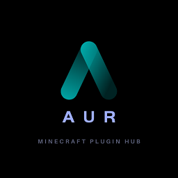

# 
 **AUR** 

##  
 让你的开服之路变的更便捷! 

什么是AUR?
------
AUR是一个插件仓库的实现, 类似于YUM的插件仓库, AUR旨在为广大腐竹提供最便捷的开服, 让你不用登陆SpigotMC或者GitHub就可以获得插件更新!
灵感来自Arch Linux的AUR.

特色
------
遍布美洲, 亚洲, 欧洲的全球化CDN, 让你无论在什么时候都可以快速的连接到AUR的插件网络!

## 现在还在开发中, 敬请期待!